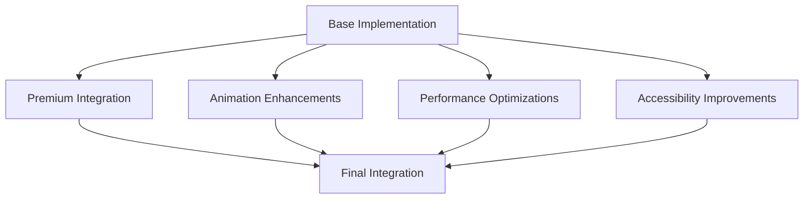

# Family Tree Enhancement Implementation Plan

## Background

After resolving the server-side rendering (SSR) issues with the D3.js visualization, we need to implement additional features to enhance the Ramen Family Tree functionality. This document outlines the plan for implementing these enhancements.

## Enhancement Requirements

1. **Premium Content Integration**
   - Proper teaser for premium content nodes
   - Integration with subscription system
   - Locked/unlocked state visualization

2. **Animation Enhancements**
   - Smooth transitions between view modes
   - Node interaction animations
   - Initial load animations

3. **Performance Optimizations**
   - Rendering optimization for large datasets
   - Lazy loading of tree data
   - Viewport-based rendering

4. **Accessibility Improvements**
   - Keyboard navigation for tree nodes
   - Screen reader support
   - ARIA attributes for interactive elements

## Implementation Strategy

## Detailed Implementation Plan

### 1. Premium Content Integration

#### 1.1 Premium Node Visualization

Enhance the node rendering to clearly indicate premium content:

- Add premium styling to nodes (gold border, special effects)
- Implement locked indicator for premium content
- Add visual distinction between free and premium nodes

#### 1.2 Premium Content Teaser

Implement an engaging premium content teaser:

- Create overlay for premium nodes with teaser information
- Design "unlock" call-to-action for premium content
- Implement preview functionality with limited information

#### 1.3 Subscription Integration

Connect the Family Tree with the subscription system:

- Integrate with PremiumLockedContent component
- Implement conditional rendering based on user subscription status
- Add upgrade flow directly from the Family Tree interface

### 2. Animation Enhancements

#### 2.1 View Mode Transitions

Implement smooth transitions between timeline and connections views:

- Add transition animations for node repositioning
- Create easing functions for natural movement
- Implement staggered animations for complex transitions

#### 2.2 Node Interaction Animations

Enhance node interactions with engaging animations:

- Add hover effects with smooth scaling
- Implement click animations with focus effects
- Create connection highlight animations when nodes are selected

#### 2.3 Initial Load Animation

Design an engaging initial load experience:

- Implement progressive node appearance animation
- Add connection line drawing animations
- Create staggered reveal of tree elements

### 3. Performance Optimizations

#### 3.1 Large Dataset Handling

Optimize rendering for larger datasets:

- Implement node clustering for distant/similar nodes
- Add level-of-detail rendering based on viewport
- Create intelligent pruning of less relevant connections

#### 3.2 Rendering Optimization

Improve rendering performance:

- Implement WebGL rendering for larger trees (using regl or three.js)
- Optimize D3.js force simulation parameters
- Add frame limiting for simulation updates

#### 3.3 Data Management

Optimize data handling for the tree:

- Implement progressive loading of tree data
- Add caching for previously viewed nodes
- Create efficient data structures for quick lookups

### 4. Accessibility Improvements

#### 4.1 Keyboard Navigation

Implement full keyboard support:

- Add tab navigation through tree nodes
- Implement arrow key navigation between connected nodes
- Create keyboard shortcuts for common actions (zoom, view toggling)

#### 4.2 Screen Reader Support

Ensure proper screen reader accessibility:

- Add descriptive text for tree visualization
- Implement announcements for dynamic content changes
- Create text alternatives for visual relationships

#### 4.3 ARIA Implementation

Add proper ARIA attributes:

- Implement role attributes for custom controls
- Add aria-label for interactive elements
- Create aria-live regions for dynamic content

## Integration Testing Strategy

1. **Component Testing**
   - Test each enhancement independently
   - Verify integration with other components
   - Validate behavior across different states

2. **User Flow Testing**
   - Test premium content upgrade flow
   - Verify navigation between tree nodes
   - Validate accessibility with screen readers

3. **Performance Testing**
   - Benchmark rendering performance
   - Test with large datasets
   - Verify animation smoothness

## Implementation Timeline

1. **Phase 1: Premium Content Integration**
   - Implement premium node visualization
   - Create premium content teaser
   - Integrate with subscription system

2. **Phase 2: Animation Enhancements**
   - Implement view mode transitions
   - Add node interaction animations
   - Create initial load animations

3. **Phase 3: Performance Optimizations**
   - Optimize large dataset handling
   - Improve rendering performance
   - Enhance data management

4. **Phase 4: Accessibility Improvements**
   - Implement keyboard navigation
   - Add screen reader support
   - Create ARIA attributes

## Future Considerations

1. **Mobile Optimization**
   - Touch-specific interactions
   - Responsive layout adjustments
   - Performance optimizations for mobile devices

2. **Advanced Filtering**
   - Timeline-based filtering
   - Lineage-specific views
   - User preference customization

3. **Social Sharing**
   - Share specific nodes/views
   - Export tree visualizations
   - Collaborative annotations

## Conclusion

This implementation plan addresses the requirements for enhancing the Ramen Family Tree visualization with premium content integration, animation enhancements, performance optimizations, and accessibility improvements. By following this plan, we will create a more engaging, performant, and accessible family tree experience for all users.