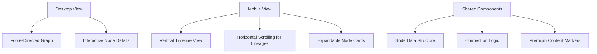
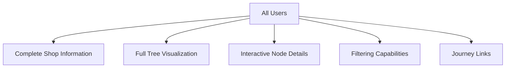
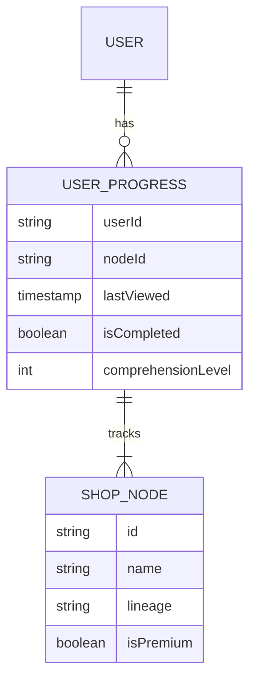
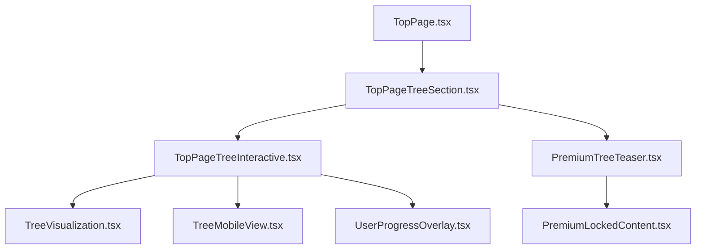

# Family Tree Implementation Plan

## 1. Mobile-Optimized Family Tree Visualization

### Mobile-First Design Approach


### Technical Implementation Details
- **Responsive Layout System**:
  - Use CSS Grid and Flexbox with media queries for layout switching
  - Implement responsive container sizes based on viewport width
  - Set dynamic node sizing that scales proportionally to screen size

- **Mobile View Transformations**:
  - For screens < 768px: Convert force-directed graph to a collapsible tree or accordion list
  - For screens < 480px: Further simplify to a vertical timeline with lineage filters
  - Implement touch-friendly interactions with larger hit areas for mobile

- **Interaction Modes by Device**:
  - Desktop: Draggable nodes, hover tooltips, zoom/pan controls
  - Tablet: Simplified drag, tap for details, pinch zoom
  - Mobile: Tap-only interface, swipe between lineages, collapsible sections

- **Performance Optimizations**:
  - Reduce node count on smaller screens (focus on main shops)
  - Implement progressive loading of node details
  - Use WebGL rendering with fallback to SVG for older devices

### Code Sample for Responsive Mode Detection:
```typescript
// TopPageTreeInteractive.tsx
import { useEffect, useState } from 'react';

export enum ViewMode {
  DESKTOP = 'desktop',
  TABLET = 'tablet', 
  MOBILE = 'mobile',
  MOBILE_SMALL = 'mobile-small'
}

export function useViewportMode() {
  const [viewMode, setViewMode] = useState<ViewMode>(ViewMode.DESKTOP);
  
  useEffect(() => {
    const handleResize = () => {
      const width = window.innerWidth;
      if (width <= 480) {
        setViewMode(ViewMode.MOBILE_SMALL);
      } else if (width <= 768) {
        setViewMode(ViewMode.MOBILE);
      } else if (width <= 1024) {
        setViewMode(ViewMode.TABLET);
      } else {
        setViewMode(ViewMode.DESKTOP);
      }
    };
    
    handleResize(); // Initial check
    window.addEventListener('resize', handleResize);
    return () => window.removeEventListener('resize', handleResize);
  }, []);
  
  return viewMode;
}
```

## 2. Freemium Content Strategy

### Content Implementation


### Implementation Details
- **Shop Node Information**:
  - Shop name, founding year, lineage type, description
  - Location and historical context
  - Notable techniques and characteristics
  - Visual representation based on lineage type

- **Tree Visualization**:
  - Show all connections between shops regardless of user status
  - Use visual cues (colors, line styles) to indicate relationship types
  - Group and categorize by lineage and time period

- **Integration with Journeys**:
  - Link tree nodes to relevant journey content where applicable
  - Indicate which journeys are premium with appropriate UI indicators
  - Keep the tree visualization itself fully accessible to all users

### Journey Connection Points
- Connect family tree nodes to related journeys
- Use subtle indicators to show which connected journeys require premium access
- Focus on creating curiosity about the journeys rather than limiting tree information

## 3. User Progress Tracking

### Progress Data Model


### Implementation Features
- **Visited Nodes Tracking**:
  - Store user's interaction with each node in local storage (non-authenticated) or database (authenticated users)
  - Visual indicators for previously visited nodes (subtle highlight or icon)
  - "Continue Exploring" shortcuts for returning users

- **Completion Status**:
  - Track completion percentage by lineage and overall tree
  - Implement a progress bar or completion circles in the UI
  - Celebrate milestones with micro-animations or badges

- **Suggested Paths**:
  - Based on previously viewed nodes, suggest logical next nodes to explore
  - Personalized recommendations for each user's exploration pattern
  - "What's New" indicators for recently added shops or updated content

### Integration with Authentication
- Anonymous users: Track progress in local storage with device identifier
- Authenticated users: Sync progress to user profile in database
- Premium users: Enhanced tracking with more detailed completion metrics

## 4. Technical Integration Plan

### Component Architecture


### State Management
- Use React Context to manage:
  - Current view mode (desktop/tablet/mobile)
  - Tree interaction state
  - User progress data
  - Premium status

### Data Flow
- Tree data fetched at page load with minimal initial payload
- Progressive loading of detailed node information as needed
- User progress synced on node interaction events
- Device-specific rendering logic separated from data management

### Implementation Timeline
1. Responsive container and view mode detection (1 day)
2. Mobile-specific tree visualization (2-3 days)
3. Freemium content separation (1-2 days)
4. User progress data structure and storage (1 day)
5. Progress visualization integration (1-2 days)
6. Testing across devices and browsers (1 day)

## 5. Code Examples

### Responsive Tree Component:
```tsx
// TopPageTreeInteractive.tsx
import React from 'react';
import { useViewportMode, ViewMode } from './hooks/useViewportMode';
import DesktopTreeView from './DesktopTreeView';
import TabletTreeView from './TabletTreeView';
import MobileTreeView from './MobileTreeView';
import MobileSmallTreeView from './MobileSmallTreeView';
import { TopPageShopNode, TopPageShopLink, sampleTreeData } from '@/types/toppage-tree';
import { useUserProgress } from './hooks/useUserProgress';

interface TopPageTreeInteractiveProps {
  isPremium: boolean;
}

export default function TopPageTreeInteractive({ isPremium }: TopPageTreeInteractiveProps) {
  const viewMode = useViewportMode();
  const { visitedNodes, markNodeAsVisited } = useUserProgress();
  
  // Get the full tree data for all users
  const treeData = React.useMemo(() => {
    return sampleTreeData;
  }, []);
  
  // Handle node click/tap
  const handleNodeInteraction = (nodeId: string) => {
    markNodeAsVisited(nodeId);
    // Additional interaction logic
  };
  
  // Render appropriate view based on viewport size
  switch (viewMode) {
    case ViewMode.DESKTOP:
      return <DesktopTreeView 
        treeData={treeData} 
        visitedNodes={visitedNodes}
        onNodeClick={handleNodeInteraction}
        isPremium={isPremium}
      />;
    case ViewMode.TABLET:
      return <TabletTreeView 
        treeData={treeData} 
        visitedNodes={visitedNodes}
        onNodeClick={handleNodeInteraction}
        isPremium={isPremium}
      />;
    case ViewMode.MOBILE:
      return <MobileTreeView 
        treeData={treeData} 
        visitedNodes={visitedNodes}
        onNodeClick={handleNodeInteraction}
        isPremium={isPremium}
      />;
    case ViewMode.MOBILE_SMALL:
      return <MobileSmallTreeView 
        treeData={treeData} 
        visitedNodes={visitedNodes}
        onNodeClick={handleNodeInteraction}
        isPremium={isPremium}
      />;
  }
}
```

### Tree Node Component:
```tsx
// TreeNode.tsx
import React from 'react';
import { motion } from 'framer-motion';
import Link from 'next/link';
import { TopPageShopNode } from '@/types/toppage-tree';

interface TreeNodeProps {
  node: TopPageShopNode;
  isVisited: boolean;
  onClick: (id: string) => void;
  connectedJourneys?: {
    id: string;
    name: string;
    isPremium: boolean;
    url: string;
  }[];
}

export default function TreeNode({
  node,
  isVisited,
  onClick,
  connectedJourneys = []
}: TreeNodeProps) {
  const [isExpanded, setIsExpanded] = React.useState(false);
  
  const handleClick = () => {
    onClick(node.id);
    setIsExpanded(!isExpanded);
  };
  
  return (
    <motion.div
      className={`tree-node ${isVisited ? 'visited' : ''}`}
      whileHover={{ scale: 1.05 }}
      onClick={handleClick}
    >
      <div className="node-basic-info">
        <h4>{node.name}</h4>
        <span className="year">{node.foundingYear}</span>
        <span className="lineage-tag">{node.lineage}</span>
      </div>
      
      {isExpanded && (
        <div className="node-expanded">
          <p className="node-description">{node.description}</p>
          
          {/* Related journeys section */}
          {connectedJourneys.length > 0 && (
            <div className="related-journeys">
              <h5>Related Journeys</h5>
              <ul>
                {connectedJourneys.map(journey => (
                  <li key={journey.id}>
                    <Link href={journey.url}>
                      {journey.name}
                      {journey.isPremium && (
                        <span className="premium-badge">Premium</span>
                      )}
                    </Link>
                  </li>
                ))}
              </ul>
            </div>
          )}
        </div>
      )}
      
      {/* Visual indicator for visited nodes */}
      {isVisited && <div className="visited-indicator" />}
    </motion.div>
  );
}
```

### Mobile Tree Implementation (Timeline View):
```tsx
// MobileTreeView.tsx
import React from 'react';
import { motion } from 'framer-motion';
import { LineageColors, LineageLabels, LineageType } from '@/types/toppage-tree';

interface MobileTreeViewProps {
  treeData: {
    nodes: any[];
    links: any[];
  };
  visitedNodes: string[];
  onNodeClick: (id: string) => void;
  isPremium: boolean;
}

export default function MobileTreeView({ 
  treeData, 
  visitedNodes, 
  onNodeClick,
}: MobileTreeViewProps) {
  const [selectedLineage, setSelectedLineage] = React.useState<LineageType | 'all'>('all');
  
  // Filter nodes by selected lineage
  const filteredNodes = React.useMemo(() => {
    if (selectedLineage === 'all') {
      return treeData.nodes;
    }
    return treeData.nodes.filter(node => node.lineage === selectedLineage);
  }, [treeData.nodes, selectedLineage]);
  
  // Sort nodes by founding year for timeline
  const sortedNodes = React.useMemo(() => {
    return [...filteredNodes].sort((a, b) => 
      (a.foundingYear || 0) - (b.foundingYear || 0)
    );
  }, [filteredNodes]);
  
  return (
    <div className="mobile-tree-container">
      {/* Horizontal lineage selector */}
      <div className="lineage-selector">
        <button 
          className={`lineage-button ${selectedLineage === 'all' ? 'active' : ''}`}
          onClick={() => setSelectedLineage('all')}
        >
          All Styles
        </button>
        {Object.entries(LineageLabels).map(([key, label]) => (
          <button 
            key={key}
            className={`lineage-button ${selectedLineage === key ? 'active' : ''}`}
            style={{ 
              '--accent-color': LineageColors[key as LineageType] 
            } as React.CSSProperties}
            onClick={() => setSelectedLineage(key as LineageType)}
          >
            {label}
          </button>
        ))}
      </div>
      
      {/* Vertical timeline */}
      <div className="timeline-container">
        <div className="timeline-line" />
        
        {sortedNodes.map((node, index) => (
          <motion.div 
            key={node.id}
            className={`timeline-node ${visitedNodes.includes(node.id) ? 'visited' : ''}`}
            initial={{ opacity: 0, x: -20 }}
            animate={{ opacity: 1, x: 0 }}
            transition={{ delay: index * 0.1 }}
            onClick={() => onNodeClick(node.id)}
          >
            <div className="timeline-year">{node.foundingYear || 'Unknown'}</div>
            <div 
              className="timeline-node-marker"
              style={{ 
                backgroundColor: LineageColors[node.lineage],
                border: visitedNodes.includes(node.id) ? '2px solid white' : 'none'
              }}
            />
            <div className="timeline-node-content">
              <h4>{node.name}</h4>
              <p>{node.description}</p>
              
              {node.connectedJourneys && node.connectedJourneys.some(j => j.isPremium) && (
                <div className="journey-indicator">
                  <svg viewBox="0 0 24 24" width="16" height="16">
                    <path d="M12 2L2 7l10 5 10-5-10-5zM2 17l10 5 10-5M2 12l10 5 10-5"
                    fill="none" stroke="currentColor" strokeWidth="2"/>
                  </svg>
                  <span>Related Journeys</span>
                </div>
              )}
            </div>
          </motion.div>
        ))}
      </div>
      
      {/* Progress indicator */}
      <div className="progress-indicator">
        <div className="progress-text">
          Explored: {visitedNodes.filter(id => 
            sortedNodes.some(node => node.id === id)
          ).length} of {sortedNodes.length}
        </div>
        <div className="progress-bar-container">
          <div 
            className="progress-bar"
            style={{ 
              width: `${(visitedNodes.filter(id => 
                sortedNodes.some(node => node.id === id)
              ).length / sortedNodes.length) * 100}%` 
            }}
          />
        </div>
      </div>
    </div>
  );
}
```

## 6. Testing Plan

1. **Device Testing Matrix**:
   - Desktop: Chrome, Firefox, Safari, Edge
   - Tablet: iPad (Safari), Android tablets (Chrome)
   - Mobile: iPhone (Safari), Android phones (Chrome)
   - Small mobile: iPhone SE size, older Android devices

2. **User Scenarios**:
   - New user first view
   - Returning user (with progress)
   - Journey discovery through tree exploration
   - Cross-device usage patterns (start on mobile, continue on desktop)

3. **Performance Metrics**:
   - Initial load time
   - Interaction responsiveness
   - Memory usage (particularly important for mobile)
   - Battery impact for animations

4. **Accessibility Testing**:
   - Screen reader compatibility
   - Keyboard navigation
   - Color contrast
   - Touch target size on mobile

## 7. Integration with TopPage Component

To integrate the Family Tree showcase into the existing TopPage.tsx component, we'll:

1. Create a new section between the Journey Types and Featured Journey sections
2. Import the TopPageTreeSection component
3. Pass necessary props for premium status detection and localization

```tsx
// TopPage.tsx update
import React from 'react';
import Link from 'next/link';
import styles from './TopPage.module.css';
import TopPageTreeSection from './TopPageTreeSection';

// ... existing code ...

export default function TopPage({ locale = 'en' }: TopPageProps) {
  // ... existing code ...

  return (
    <div className={styles.container}>
      <h1 className={styles.title}>Ramen Journey</h1>
      
      {/* Hero Section */}
      <div className={styles.heroSection}>
        {/* ... hero content ... */}
      </div>
      
      {/* Journey Types Section */}
      <div className={styles.cardContainer}>
        {/* ... journey types ... */}
      </div>

      {/* Family Tree Showcase Section - NEW */}
      <TopPageTreeSection locale={locale} />
      
      {/* Featured Journey Section */}
      <div className={styles.featuredSection}>
        {/* ... featured journey content ... */}
      </div>
    </div>
  );
}
```

The TopPageTreeSection component will handle:
- Responsive rendering based on device size
- User progress tracking and visualization
- Premium vs. free content differentiation
- Smooth interaction and animations

## 8. Next Steps and Implementation Order

1. Create the basic component structure:
   - TopPageTreeSection.tsx 
   - TopPageTreeInteractive.tsx
   - Related view components for different device sizes

2. Implement the responsive layout system:
   - Viewport detection hook
   - CSS modules for each view mode
   - Base styling and animations

3. Build the freemium content layer:
   - Integration with PremiumLockedContent component
   - Context-aware premium teasing
   - Node detail levels implementation

4. Develop the user progress tracking system:
   - Local storage integration
   - User progress visualization
   - "Continue exploring" functionality

5. Optimize for performance:
   - Lazy loading of detailed node data
   - Throttled animations for mobile
   - Progressive enhancement strategy

6. Comprehensive testing:
   - Cross-device testing
   - Performance benchmarking
   - Accessibility auditing