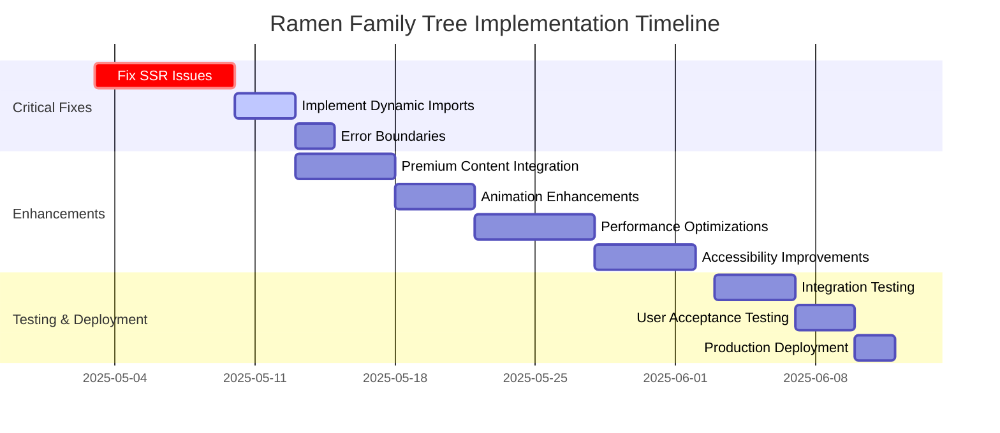

# Ramen Journey Family Tree Implementation Roadmap

## Overview

This roadmap outlines the complete implementation plan for fixing the current SSR issues and enhancing the Ramen Family Tree feature. It combines both critical fixes and new feature development into a cohesive timeline with clear milestones and dependencies.

## Implementation Phases

## Phase 1: Critical Fixes (Priority)

### 1.1 SSR Issues Resolution

**Objective**: Fix all Next.js server-side rendering issues with D3.js visualization

**Tasks**:
- Implement proper 'use client' boundaries
- Create dynamic import wrapper with SSR disabled
- Add browser environment detection
- Fix configuration issues in Next.js setup

**Dependencies**: None

**Estimated Duration**: 1 week

**Success Criteria**: 
- No SSR errors when rendering the Family Tree
- Clean console with no hydration warnings
- Proper loading states during visualization initialization

### 1.2 Dynamic Import Implementation

**Objective**: Ensure proper client-side only rendering of D3.js components

**Tasks**:
- Create InteractiveTreeWrapper component
- Implement loading fallback UI
- Update all tree component references to use the wrapper
- Add proper cleanup for D3.js resources

**Dependencies**: SSR Issues Resolution

**Estimated Duration**: 3 days

**Success Criteria**:
- Tree visualization only initializes on client side
- Clean component mounting and unmounting
- No memory leaks from D3.js references

### 1.3 Error Handling Improvements

**Objective**: Add robust error handling for visualization failures

**Tasks**:
- Implement TreeErrorBoundary component
- Add fallback UI for error states
- Create error reporting mechanism
- Add recovery options for visualization errors

**Dependencies**: Dynamic Import Implementation

**Estimated Duration**: 2 days

**Success Criteria**:
- Graceful failure handling for visualization errors
- User-friendly error messages
- Recovery options that don't require page refresh

## Phase 2: Feature Enhancements

### 2.1 Premium Content Integration

**Objective**: Enhance the tree with premium content features

**Tasks**:
- Implement premium node styling and indicators
- Create premium content teaser overlay
- Integrate with subscription system
- Add upgrade flow from tree interface

**Dependencies**: Phase 1 completion

**Estimated Duration**: 5 days

**Success Criteria**:
- Clear visual distinction for premium content
- Engaging premium teaser UI
- Smooth upgrade flow for non-premium users

### 2.2 Animation Enhancements

**Objective**: Add engaging animations to the tree visualization

**Tasks**:
- Implement view mode transitions
- Add node interaction animations
- Create initial load animation sequence
- Optimize animations for performance

**Dependencies**: Premium Content Integration

**Estimated Duration**: 4 days

**Success Criteria**:
- Smooth transitions between visualization states
- Engaging but not distracting animations
- Consistent animation performance across devices

### 2.3 Performance Optimizations

**Objective**: Optimize rendering for larger datasets and improved responsiveness

**Tasks**:
- Implement level-of-detail rendering
- Add node clustering for large datasets
- Optimize force simulation parameters
- Implement WebGL rendering for complex visualizations

**Dependencies**: Animation Enhancements

**Estimated Duration**: 6 days

**Success Criteria**:
- Smooth rendering with 100+ nodes
- Responsive interactions even with large datasets
- Optimized memory usage during visualization

### 2.4 Accessibility Improvements

**Objective**: Make the tree visualization accessible to all users

**Tasks**:
- Implement keyboard navigation
- Add screen reader support
- Create ARIA attributes for custom controls
- Add text alternatives for visual relationships

**Dependencies**: Performance Optimizations

**Estimated Duration**: 5 days

**Success Criteria**:
- Full keyboard navigation support
- Screen reader announcements for tree interactions
- WCAG 2.1 AA compliance for tree visualization

## Phase 3: Testing & Deployment

### 3.1 Integration Testing

**Objective**: Verify all components work together correctly

**Tasks**:
- Test component integration
- Verify data flow between components
- Test browser compatibility
- Perform responsive layout testing

**Dependencies**: Phase 2 completion

**Estimated Duration**: 4 days

**Success Criteria**:
- All components function correctly together
- Consistent behavior across supported browsers
- Proper responsive behavior across device sizes

### 3.2 User Acceptance Testing

**Objective**: Validate that the implementation meets user needs

**Tasks**:
- Conduct user testing sessions
- Gather feedback on usability
- Test premium content flow with real users
- Validate accessibility with assistive technology users

**Dependencies**: Integration Testing

**Estimated Duration**: 3 days

**Success Criteria**:
- Positive user feedback
- Successful completion of key user tasks
- Effective premium conversion from tree interactions

### 3.3 Production Deployment

**Objective**: Deploy the complete Family Tree implementation to production

**Tasks**:
- Prepare deployment package
- Update documentation
- Deploy to staging environment
- Perform final validation
- Deploy to production

**Dependencies**: User Acceptance Testing

**Estimated Duration**: 2 days

**Success Criteria**:
- Successful deployment to production
- No regression issues
- Performance metrics within targets

## Resource Requirements

### Development Resources

- **Frontend Developer**: Primary resource for implementation
- **UX Designer**: Support for animation design and accessibility review
- **QA Engineer**: Testing support

### Technical Requirements

- D3.js version 7.x or newer
- Next.js 13.x with App Router support
- Modern browser support (Chrome, Firefox, Safari, Edge)
- TypeScript 5.x for type safety

## Risk Assessment & Mitigation

| Risk | Impact | Likelihood | Mitigation |
|------|--------|------------|------------|
| D3.js compatibility issues with Next.js | High | Medium | Create isolated test environment, use specific version pinning |
| Performance degradation with large datasets | Medium | High | Implement progressive loading, use WebGL for rendering |
| Browser compatibility issues | Medium | Medium | Test across multiple browsers early, implement fallbacks |
| Subscription system integration complexity | High | Medium | Create mock API during development, coordinate with backend team |
| Animation performance on mobile devices | Medium | High | Test on low-end devices, implement simplified mobile animations |

## Dependencies & Integration Points

### Internal Dependencies

- **Subscription System**: For premium content integration
- **User Authentication**: For user-specific tree experiences
- **Analytics**: For tracking premium conversion
- **Content Database**: For tree node data

### External Dependencies

- **D3.js Library**: Core visualization dependency
- **Three.js/regl**: For WebGL rendering (optional)
- **Animation Libraries**: For complex animations (optional)

## Monitoring & Metrics

### Key Performance Indicators

- **Rendering Time**: < 1s for initial tree visualization
- **Interaction Response**: < 100ms for node selection/hover
- **Memory Usage**: < 50MB for complete tree visualization
- **Premium Conversion Rate**: Track clicks on premium upgrade buttons

### Monitoring Plan

- Implement performance monitoring for tree visualization
- Track error rates and types for visualization component
- Monitor premium content conversion funnel
- Collect user interaction patterns with tree

## Conclusion

This roadmap provides a comprehensive plan for implementing the Ramen Family Tree feature, from fixing critical SSR issues to enhancing the visualization with premium content, animations, performance optimizations, and accessibility improvements. By following this structured approach, we can ensure a successful implementation that delivers value to users while maintaining technical excellence.

The implementation balances the need to quickly address critical issues while methodically building out enhanced features that will differentiate the Ramen Journey platform. Regular testing and validation throughout the process will ensure that the final product meets both technical and user requirements.