# Ramen Family Tree - Phase 2 Implementation Plan

## Current Status Summary

Based on our review of the current codebase and implementation status, we've successfully completed the critical Phase 1 fixes:

- ✅ SSR issues have been resolved using proper client-side rendering techniques
- ✅ Dynamic imports have been implemented with the InteractiveTreeWrapper component
- ✅ Basic error handling and memory leak prevention are in place
- ✅ Core visualization components are functioning for both desktop and mobile views
- ✅ The application correctly handles the visualization of different ramen lineages and shop importance levels

## Priority Implementation Tasks for Phase 2

```mermaid
graph TD
    A[Phase 2 Implementation] --> B[Premium Content Integration]
    A --> C[Animation Enhancements]
    A --> D[Performance Optimizations]
    A --> E[Accessibility Improvements]
    A --> F[Testing & Validation]

    B --> B1[Premium Node/Link Styling]
    B --> B2[Premium Content Teaser UI]
    B --> B3[Subscription Integration]
    B --> B4[Premium Upgrade Flow]

    C --> C1[View Mode Transitions]
    C --> C2[Node Interaction Animations]
    C --> C3[Initial Load Animation]

    D --> D1[Level-of-Detail Rendering]
    D --> D2[Node Clustering]
    D --> D3[Force Simulation Optimization]
    D --> D4[WebGL Rendering Option]

    E --> E1[Keyboard Navigation]
    E --> E2[Screen Reader Support]
    E --> E3[ARIA Attributes]
    E --> E4[Focus Management]

    F --> F1[Automated Tests]
    F --> F2[Performance Benchmarks]
    F --> F3[Cross-browser Testing]
    F --> F4[Device Testing]
```



## 1. Premium Content Integration

### 1.1 Premium Node & Link Styling Enhancement

**Current Status:** Basic premium node styling exists, but needs enhancement and consistent implementation.

**Implementation Steps:**
1. Refine the premium node visual indicators in TreeNode.tsx:
   - Add subtle animation to the premium star indicator
   - Implement consistent styling across both mobile and desktop views
   - Ensure premium indicators scale appropriately with node size

2. Enhance premium link styling in TopPageInteractiveTree.tsx:
   - Use dashed or unique patterns for premium relationship links
   - Implement consistent coloring for premium links
   - Add hover effects that highlight premium status

3. Create reusable premium styling constants:
   - Define premium colors, patterns, and effects in a shared constants file
   - Ensure consistent premium indicators across components

**Technical Considerations:**
- Use CSS variables for premium styling to enable theme changes
- Ensure premium indicators are visible but not distracting
- Test visibility of indicators at different zoom levels

**Estimated Effort:** 1.5 days

### 1.2 Premium Content Teaser UI

**Implementation Steps:**
1. Create PremiumContentTeaser component:
   ```typescript
   // Structure of PremiumContentTeaser component
   interface PremiumContentTeaserProps {
     content: {
       title: string;
       description: string;
       imageUrl?: string;
     };
     onUpgradeClick: () => void;
     onDismiss: () => void;
   }
   ```

2. Integrate teaser with node interactions:
   - Update click handlers in TopPageInteractiveTree to show teaser for premium nodes
   - Implement similar handling in MobileTreeView
   - Add animation for teaser appearance/disappearance

3. Design engaging teaser UI:
   - Show preview of premium content with blur/cutoff effect
   - Add clear call-to-action for premium upgrade
   - Include dismissal option for users not interested

**Technical Considerations:**
- Use React Portal for overlay to avoid layout issues
- Implement focus trapping for accessibility
- Ensure teaser works on both mobile and desktop views

**Estimated Effort:** 2 days

### 1.3 Subscription System Integration

**Implementation Steps:**
1. Create PremiumStatusProvider context:
   ```typescript
   // Premium status provider structure
   const PremiumStatusContext = createContext<{
     isPremiumUser: boolean;
     checkPremiumAccess: (contentId: string) => boolean;
     upgradeAccount: () => Promise<void>;
   }>({ 
     isPremiumUser: false, 
     checkPremiumAccess: () => false,
     upgradeAccount: async () => {},
   });
   ```

2. Integrate with Supabase authentication:
   - Use the existing client.ts authentication
   - Add premium status check to user profile fetching
   - Implement caching for premium status checks

3. Update tree components to use PremiumStatusProvider:
   - Replace hardcoded isPremiumUser props with context
   - Add premium access checks for specific content

**Technical Considerations:**
- Include loading states for premium status checks
- Handle authentication edge cases (expired session, etc.)
- Add offline support with cached premium status

**Estimated Effort:** 2 days

### 1.4 Premium Upgrade Flow

**Implementation Steps:**
1. Create PremiumUpgradeModal component:
   - Design engaging upgrade UI with benefits list
   - Implement pricing options and subscription tiers
   - Add secure payment flow integration

2. Connect upgrade flow to premium teasers:
   - Link "Upgrade" buttons to open modal
   - Track conversion metrics for premium teasers
   - Implement post-upgrade content unlock

3. Add success/confirmation state:
   - Design confirmation screen after successful upgrade
   - Immediately update UI to reflect new premium status
   - Provide access to newly unlocked premium content

**Technical Considerations:**
- Integrate with secure payment provider
- Handle payment errors gracefully
- Ensure premium status updates in real-time across components

**Estimated Effort:** 2 days

## 2. Animation Enhancements

### 2.1 View Mode Transitions

**Implementation Steps:**
1. Add smooth transitions between connections and timeline views:
   - Implement staged transition with element grouping
   - Add position interpolation for nodes changing location
   - Create coordinated fade effects for appearing/disappearing elements

2. Enhance view toggle button:
   - Add animation to button icon during transitions
   - Disable interactions during transition
   - Add progress indicator for longer transitions

3. Optimize transition performance:
   - Use requestAnimationFrame for smooth animations
   - Batch DOM updates during transitions
   - Implement progressive transition for large datasets

**Technical Considerations:**
- Use CSS transitions for simple animations
- Use D3's transition API for complex animations
- Test on lower-end devices to ensure performance

**Estimated Effort:** 1.5 days

### 2.2 Node Interaction Animations

**Implementation Steps:**
1. Enhance node hover interactions:
   - Add subtle pulse animation on hover
   - Implement smooth tooltip appearance/disappearance
   - Add highlighting of connected nodes on hover

2. Improve node click interactions:
   - Add selection animation for clicked nodes
   - Implement camera/view transition to center selected node
   - Add animation for node detail panel appearance

3. Create visual feedback for visited nodes:
   - Add animation when marking a node as visited
   - Implement subtle persistent animation for important unvisited nodes
   - Create transition effect when node status changes

**Technical Considerations:**
- Keep animations subtle and non-distracting
- Ensure animations work at different zoom levels
- Test touch interactions for mobile devices

**Estimated Effort:** 1.5 days

### 2.3 Initial Load Animation

**Implementation Steps:**
1. Design engaging initial load sequence:
   - Create staggered appearance of nodes by importance
   - Implement animated connection of links
   - Add initial simulation settling animation

2. Add progressive detail loading:
   - Start with major nodes and gradually add detail
   - Animate label appearance after nodes settle
   - Implement zoom animation to show full context

3. Create intro/tutorial overlay:
   - Design first-time user intro animation
   - Add interactive tutorial hints
   - Implement skippable intro for returning users

**Technical Considerations:**
- Keep initial load time reasonable despite animations
- Implement animation skip option for returning users
- Ensure animations work properly after suspense/lazy loading

**Estimated Effort:** 1 day

## 3. Performance Optimizations

### 3.1 Level-of-Detail Rendering

**Implementation Steps:**
1. Implement detail level based on zoom:
   ```typescript
   // Pseudo-code for level of detail management
   const getNodeDetailLevel = (node: TopPageShopNode, zoomLevel: number): DetailLevel => {
     if (zoomLevel < 0.5) return 'minimal';
     if (zoomLevel < 1.0) return node.importance <= 2 ? 'medium' : 'minimal';
     return 'full';
   };
   ```

2. Optimize label rendering:
   - Only show labels for important nodes at low zoom
   - Implement label clustering for dense areas
   - Add progressive label loading on zoom

3. Create dynamic link simplification:
   - Simplify link rendering at low zoom levels
   - Group links between clusters
   - Optimize link path calculations

**Technical Considerations:**
- Avoid layout thrashing during zoom operations
- Use requestIdleCallback for non-critical updates
- Implement caching for calculated detail levels

**Estimated Effort:** 2 days

### 3.2 Node Clustering

**Implementation Steps:**
1. Implement node clustering algorithm:
   - Group nodes by lineage and proximity
   - Create expandable/collapsible clusters
   - Maintain cluster identity during interactions

2. Design cluster visualization:
   - Create visual representation for node clusters
   - Show count and key information in collapsed state
   - Implement expand/collapse interactions

3. Optimize cluster transitions:
   - Add smooth animation for cluster expansion/collapse
   - Manage force simulation during cluster changes
   - Preserve user's mental map during clustering changes

**Technical Considerations:**
- Balance clustering aggressiveness with usability
- Preserve important nodes as individual items
- Ensure clustering works with premium content indicators

**Estimated Effort:** 2 days

### 3.3 Force Simulation Optimization

**Implementation Steps:**
1. Optimize simulation parameters:
   - Fine-tune force strengths for better layouts
   - Implement dynamic force adjustment based on node count
   - Add targeted forces for better lineage grouping

2. Implement simulation scheduling:
   - Run simulation at lower priority during interaction
   - Pause simulation when not visible
   - Optimize tick updates for performance

3. Add incremental simulation stabilization:
   - Run initial layout calculation off main thread
   - Implement alpha decay strategies for faster settling
   - Add heuristics to detect stable layouts

**Technical Considerations:**
- Use Web Workers for computation-heavy operations
- Implement debouncing for simulation updates
   - Optimize for mobile devices with limited resources

**Estimated Effort:** 1.5 days

### 3.4 WebGL Rendering Option (Advanced)

**Implementation Steps:**
1. Create WebGL renderer implementation:
   - Implement regl or three.js based node rendering
   - Design shader for efficient node/link drawing
   - Add WebGL feature detection and fallback

2. Optimize for large datasets:
   - Implement instanced rendering for nodes
   - Use GPU-based force calculation where possible
   - Add efficient picking for interaction

3. Maintain visual consistency:
   - Ensure WebGL rendering matches CSS styling
   - Implement consistent animations in WebGL
   - Maintain accessibility features with WebGL

**Technical Considerations:**
- Add feature detection for WebGL support
- Implement seamless fallback to SVG rendering
- Consider bundle size impact of WebGL libraries

**Estimated Effort:** 3 days (optional/advanced)

## 4. Accessibility Improvements

### 4.1 Keyboard Navigation

**Implementation Steps:**
1. Implement focus management:
   - Add tab navigation for interactive elements
   - Create keyboard shortcuts for common actions
   - Implement focus indicators for keyboard users

2. Add keyboard control for visualization:
   - Arrow key navigation between nodes
   - Keyboard shortcuts for zooming and panning
   - Implement focus traversal based on node relationships

3. Create skip navigation options:
   - Add shortcuts to jump to main sections
   - Implement focus groups for related controls
   - Create efficient keyboard path through complex visualization

**Technical Considerations:**
- Maintain logical tab order across components
- Ensure focus is visible at all times
- Test with keyboard-only navigation

**Estimated Effort:** 1.5 days

### 4.2 Screen Reader Support

**Implementation Steps:**
1. Add descriptive ARIA attributes:
   - Implement aria-label for all interactive elements
   - Add role attributes for custom controls
   - Create descriptive announcements for state changes

2. Implement live regions for updates:
   - Add aria-live regions for important updates
   - Create clear announcements for view changes
   - Implement descriptive node selection announcements

3. Create text alternatives for visual relationships:
   - Add descriptive text for node connections
   - Implement textual representation of the tree structure
   - Create accessible explanations of lineage relationships

**Technical Considerations:**
- Test with multiple screen readers (NVDA, VoiceOver)
- Balance verbosity with usability
- Ensure announcements are timely and relevant

**Estimated Effort:** 2 days

### 4.3 Focus and Interaction Management

**Implementation Steps:**
1. Implement proper focus trapping:
   - Add focus trapping for modal elements
   - Restore focus position after modal dismissal
   - Create logical focus order within components

2. Enhance touch target sizes:
   - Ensure minimum touch target size (44x44px)
   - Add spacing between interactive elements
   - Implement touch target expansion for small elements

3. Add multi-modal interaction support:
   - Support both pointer and keyboard for all interactions
   - Implement speech input for key actions
   - Add reduced motion option for animations

**Technical Considerations:**
- Follow WCAG 2.1 AA guidelines
- Test with assistive technologies
- Include reduced motion and high contrast support

**Estimated Effort:** 1.5 days

## 5. Testing and Validation

### 5.1 Automated Testing Implementation

**Implementation Steps:**
1. Create component unit tests:
   - Implement tests for TreeNode component
   - Add tests for premium content behavior
   - Create tests for accessibility features

2. Implement integration tests:
   - Test interaction between components
   - Create tests for data flow and state management
   - Implement tests for edge cases and error handling

3. Add visual regression tests:
   - Implement screenshot-based comparison tests
   - Create tests for different viewport sizes
   - Add tests for animation and transition states

**Testing Tools:**
- Jest for unit testing
- React Testing Library for component testing
- Cypress for end-to-end testing
- Storybook for visual testing

**Estimated Effort:** Ongoing throughout implementation

### 5.2 Performance Benchmarking

**Implementation Steps:**
1. Define performance metrics:
   - Initial render time
   - Interaction responsiveness
   - Memory usage
   - Animation smoothness

2. Implement performance monitoring:
   - Add performance marks and measures
   - Create performance regression tests
   - Implement real user monitoring

3. Establish performance budgets:
   - Set maximum render time targets
   - Define memory usage limits
   - Create frame rate thresholds for animations

**Tools:**
- Lighthouse for overall performance
- Chrome DevTools Performance panel
- Custom performance tracking

**Estimated Effort:** 1 day + ongoing monitoring

## Implementation Timeline

| Week | Focus Area | Key Deliverables |
|------|------------|------------------|
| Week 1 | Premium Content Integration | - Enhanced premium styling<br>- Premium teaser UI<br>- Basic subscription integration |
| Week 2 | Animation & Performance | - View mode transitions<br>- Node interaction animations<br>- Level-of-detail rendering |
| Week 3 | Performance & Accessibility | - Node clustering<br>- Force simulation optimization<br>- Keyboard navigation |
| Week 4 | Accessibility & Testing | - Screen reader support<br>- Focus management<br>- Automated tests<br>- Performance benchmarks |

## Key Dependencies and Risk Factors

1. **Subscription System Integration**
   - Dependency on Supabase authentication
   - Risk: API changes or authentication issues
   - Mitigation: Create mock subscription system for development

2. **Performance with Large Datasets**
   - Risk: Slow rendering with 100+ nodes
   - Mitigation: Implement progressive loading and WebGL rendering

3. **Cross-browser D3.js Compatibility**
   - Risk: Inconsistent behavior across browsers
   - Mitigation: Comprehensive browser testing and fallbacks

4. **Mobile Performance**
   - Risk: Poor performance on low-end devices
   - Mitigation: Aggressive optimization and simplified mobile view

## Success Criteria

1. **Performance Metrics**
   - Initial render: < 1.5s on desktop, < 2.5s on mobile
   - Interaction response: < 100ms for node selection/hover
   - Memory usage: < 100MB for complete tree visualization
   - Animation framerate: Consistent 60fps for transitions

2. **Accessibility Compliance**
   - WCAG 2.1 AA compliance for all components
   - Full keyboard navigation support
   - Screen reader compatibility for core features

3. **User Experience**
   - Clear distinction for premium content
   - Intuitive navigation and interaction
   - Smooth, engaging animations
   - Consistent behavior across devices

4. **Premium Conversion**
   - Measurable increase in premium subscription signups
   - Positive user feedback on premium content teasers
   - Smooth upgrade flow with high completion rate

## Conclusion

This implementation plan provides a structured approach to enhancing the Ramen Family Tree visualization with premium features, performance optimizations, and accessibility improvements. By following this plan, we can deliver a high-quality, engaging visualization that provides value to users while encouraging premium subscriptions.

The plan builds upon the successful completion of Phase 1, which fixed critical SSR issues and established the basic visualization framework. Phase 2 focuses on refining the user experience, optimizing performance, and adding value through premium content integration.

By prioritizing both technical excellence and user experience, we can create a family tree visualization that serves as a centerpiece of the RamenJourney application and drives premium subscription value.