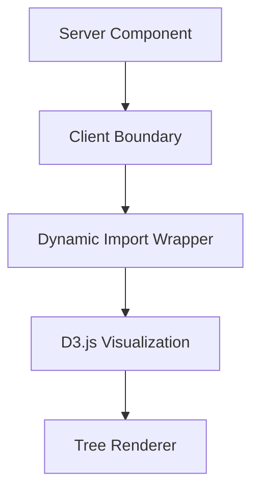

# Family Tree SSR Fix Implementation Plan

## Background

The Ramen Journey family tree implementation uses D3.js for interactive visualizations, which is causing server-side rendering (SSR) errors in Next.js because D3.js relies on browser DOM APIs not available during server rendering. This document outlines a comprehensive plan to fix these issues.

## Current Issues

1. D3.js code is being executed during server-side rendering despite 'use client' directives
2. No proper loading states or fallbacks for client-side only components
3. Direct DOM manipulation via D3.js causes hydration mismatches
4. Configuration issues with Next.js causing ENOENT errors

## Proposed Solution Architecture



## Implementation Steps

### 1. Implement Dynamic Import with Client-Side Only Loading

Create a new client boundary that properly uses dynamic imports for the D3.js visualization component:

```jsx
// InteractiveTreeWrapper.tsx
'use client';

import dynamic from 'next/dynamic';
import React from 'react';

// Placeholder component shown during loading
const TreeLoadingFallback = () => (
  <div className="tree-loading-placeholder">
    <p>Interactive visualization loading...</p>
    {/* Add skeleton UI or loading spinner */}
  </div>
);

// Dynamically import the D3 component with SSR disabled
const InteractiveTreeDynamic = dynamic(
  () => import('./TopPageInteractiveTree'),
  { 
    ssr: false,
    loading: () => <TreeLoadingFallback />
  }
);

// Wrapper component that provides the client boundary
const InteractiveTreeWrapper = (props) => {
  return <InteractiveTreeDynamic {...props} />;
};

export default InteractiveTreeWrapper;
```

### 2. Modify TopPageTreeDemo to Use the Wrapper

Update the TopPageTreeDemo component to use the new dynamic wrapper:

```jsx
import InteractiveTreeWrapper from './InteractiveTreeWrapper';

// Inside render function, replace:
// <TopPageInteractiveTree ... />
// with:
// <InteractiveTreeWrapper ... />
```

### 3. Browser Environment Detection

Enhance TopPageInteractiveTree to guarantee D3.js only executes in browser context:

```jsx
const TopPageInteractiveTree = ({ data, onNodeClick, viewMode }) => {
  // Add browser environment check
  const [isBrowser, setIsBrowser] = useState(false);
  
  useEffect(() => {
    setIsBrowser(true);
  }, []);
  
  // Only render visualization when in browser
  if (!isBrowser) {
    return <div className="tree-visualization-placeholder" />;
  }
  
  // Rest of component implementation...
}
```

### 4. Error Boundary Implementation

Create an error boundary component to gracefully handle D3.js failures:

```jsx
// TreeErrorBoundary.tsx
'use client';

import React from 'react';

class TreeErrorBoundary extends React.Component {
  constructor(props) {
    super(props);
    this.state = { hasError: false };
  }

  static getDerivedStateFromError(error) {
    return { hasError: true };
  }

  componentDidCatch(error, errorInfo) {
    console.error("Tree visualization error:", error, errorInfo);
  }

  render() {
    if (this.state.hasError) {
      return (
        <div className="tree-error-container">
          <h3>We're having trouble displaying the visualization</h3>
          <p>Please try refreshing the page or return later.</p>
          <button onClick={() => this.setState({ hasError: false })}>
            Try Again
          </button>
        </div>
      );
    }

    return this.props.children;
  }
}
```

### 5. Refactor D3.js Initialization

Optimize the D3.js initialization process:

1. Move D3.js initialization to a separate utility function
2. Ensure cleanup of D3 references when component unmounts
3. Handle window resize events with proper cleanup
4. Use React refs consistently instead of direct DOM queries

### 6. Safe DOM Reference Management

Update the D3.js code to handle DOM references safely:

```jsx
useEffect(() => {
  if (!svgRef.current || !data.nodes.length || !isBrowser) return;
  
  // Rest of D3 initialization...
  
  return () => {
    // Proper cleanup
    if (simulation) simulation.stop();
    if (svgRef.current) {
      d3.select(svgRef.current).selectAll('*').remove();
    }
  };
}, [data, dimensions, viewMode, onNodeClick, isBrowser]);
```

## Next.js Configuration Updates

### 1. Module Transpilation for D3.js

Update the Next.js configuration to properly handle D3.js:

```js
// next.config.js
module.exports = {
  // Existing configuration...
  
  webpack: (config, { isServer }) => {
    // Handle D3.js modules properly
    if (!isServer) {
      config.resolve.fallback = {
        ...config.resolve.fallback,
        fs: false,
        module: false,
      };
    }
    
    return config;
  },
  
  // Add experimental flag for App Router handling of client-only components
  experimental: {
    appDir: true,
    serverComponentsExternalPackages: ['d3']
  }
};
```

### 2. Client Directives Enforcement

Ensure proper usage of client directives in all components that use browser APIs:

- Add 'use client' directive at the top of any file that:
  - Uses browser APIs like localStorage, window, document
  - Imports D3.js or other browser-only libraries
  - Uses React hooks that rely on browser environment

## Testing Strategy

1. **Incremental Testing**:
   - Test each component in isolation after modifications
   - Verify client-side only rendering works correctly
   - Check for hydration warnings in browser console

2. **Server Component Verification**:
   - Ensure server components don't import client-only code
   - Validate proper separation between server and client code

3. **Responsive Testing**:
   - Test visualization across different viewport sizes
   - Verify resize handling works properly

4. **Error Handling Testing**:
   - Simulate errors in D3.js initialization
   - Verify error boundary captures and displays fallback UI

## Performance Considerations

1. **Lazy Loading Optimization**:
   - Ensure D3.js is only loaded when visualization is in viewport
   - Consider using Intersection Observer API for lazy initialization

2. **Throttle Resize Events**:
   - Implement debounce for window resize handlers
   - Optimize dimension calculations to minimize re-renders

3. **Memoization**:
   - Use React.memo() for tree components
   - Implement useMemo for expensive calculations
   - Use useCallback for event handlers passed to children

## Accessibility Enhancements

1. **Non-Visual Alternatives**:
   - Add screen reader text describing the family tree
   - Provide keyboard navigation for tree nodes

2. **ARIA Attributes**:
   - Add appropriate ARIA roles, labels and descriptions
   - Ensure interactive elements are properly announced

## Implementation Timeline

1. **Phase 1: Core SSR Fix** (Priority)
   - Implement dynamic imports with SSR: false
   - Create wrapper component with proper loading states
   - Add browser environment detection

2. **Phase 2: Error Handling**
   - Implement error boundaries
   - Add fallback UI components
   - Create error reporting mechanism

3. **Phase 3: Optimization**
   - Refactor D3.js initialization
   - Implement performance enhancements
   - Add accessibility features

## Conclusion

This implementation plan addresses the core SSR issues with D3.js visualization in Next.js while improving error handling, performance and accessibility. By properly separating client and server concerns and implementing dynamic imports correctly, we can ensure the Family Tree visualization renders correctly without causing hydration or SSR errors.