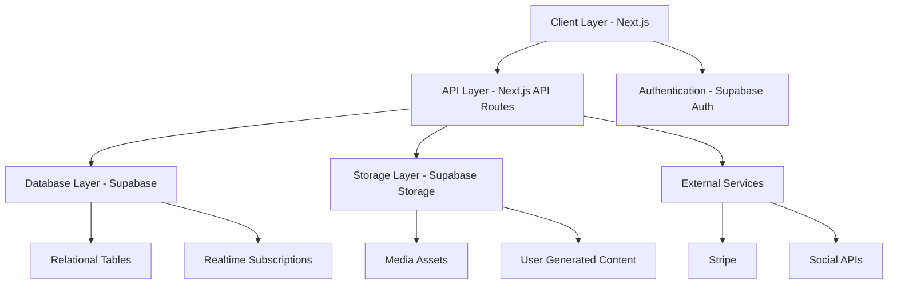

# RamenJourney.app Technical Specification Document

## Executive Summary

RamenJourney.app is a web-based application that helps ramen enthusiasts discover their taste preferences, explore ramen lineages (starting with IEKEI/家系), and track their journey through the ramen world. The app will follow a mobile-first approach with a focus on interactive visualization, personalized recommendations, and educational content.

This document outlines the technical specifications, architecture, and implementation plan for the development of RamenJourney.app.

## 1. Technical Architecture



### 1.1 Frontend Architecture

- **Framework**: Next.js 14+ with App Router
- **Rendering Strategy**: 
  - Server Components for static content
  - Client Components for interactive elements
  - Streaming for incremental page loading
- **State Management**: 
  - React Context for global app state
  - Tanstack Query (React Query) for server state
  - Zustand for complex client-side state
- **Styling**: 
  - Tailwind CSS for responsive design
  - CSS Modules for component-specific styling
  - Framer Motion for animations
- **Data Visualization**: 
  - D3.js for interactive family tree
  - React-Force-Graph for mobile-optimized network visualization
- **Form Handling**: React Hook Form with Zod validation

### 1.2 Backend Services

- **Database**: Supabase PostgreSQL
- **Authentication**: Supabase Auth with Google provider
- **Storage**: Supabase Storage
- **Serverless Functions**: Next.js API Routes
- **Webhooks**: Stripe subscription events

### 1.3 External Services Integration

- **Payment Processing**: Stripe Subscription API
- **Social Sharing**: Web Share API + custom handlers

## 2. Core Feature Specifications

### 2.1 Interactive Family Tree Visualization

#### 2.1.1 Technical Implementation

- **Visualization Engine**: D3.js for desktop, React-Force-Graph for mobile
- **Data Structure**: JSON graph with nodes (shops) and edges (relationships)
- **Rendering Strategy**: 
  - Canvas rendering for performance
  - SVG overlays for interactive elements
- **Mobile Optimization**:
  - Pinch-to-zoom gesture support
  - Touch-friendly node selection
  - Collapsible detail panels
  - Simplified view on smaller screens

#### 2.1.2 Key Functionality

- **Node Representation**: 
  - Each ramen shop is a node
  - Nodes are color-coded by lineage type
  - Node size can indicate popularity or historical significance
- **Connection Highlighting**:
  - When a shop is selected, all related shops in the same lineage light up
  - Animated paths show the connection to the root (Yoshimuraya)
  - Visual indicators show the "generation" of each shop
- **Interactive Elements**:
  - Tap/click to expand shop details
  - Long-press for additional options
  - Swipe to navigate the tree
  - Pinch to zoom in/out
- **Filtering & Search**:
  - Filter by lineage type (direct, classic, etc.)
  - Filter by location (Tokyo, Yokohama, etc.)
  - Search by shop name
  - Filter by user visits (visited/not visited)

#### 2.1.3 Mobile UI/UX Specifics

- **Bottom Sheet Interface**:
  - Expandable panel for shop details
  - Swipe up for full details, down to minimize
- **Navigation Controls**:
  - Floating action buttons for zoom controls
  - Home button to reset view
  - Fullscreen toggle
- **Gesture Recognition**:
  - Double-tap to center on node
  - Two-finger rotate for 3D view (if implemented)
  - Shake to reset view
- **Performance Optimizations**:
  - Dynamic level-of-detail rendering
  - Viewport culling for off-screen nodes
  - Lazy loading of shop details

### 2.2 Taste Profile System

#### 2.2.1 Quiz Structure

- **Question Types**:
  - Visual preferences (image selection)
  - Flavor intensity scale (slider)
  - Binary preference choices
  - Hypothetical scenarios
- **Sample Questions**:
  1. "Select the bowl of ramen that looks most appealing to you" (with images showing different styles)
  2. "How rich do you prefer your broth?" (slider from light to intense)
  3. "Do you prefer a strong garlic flavor or a more balanced taste?"
  4. "If you had to choose between richness and freshness, which would you pick?"
  5. "Select your preferred noodle texture" (with visual options from soft to very firm)

#### 2.2.2 Preference Mapping Algorithm

- **Key Taste Dimensions**:
  1. Richness (さ): 1-10 scale from light to intensely rich
  2. Oiliness (油): 1-10 scale from dry to very oily
  3. Firmness (硬さ): 1-10 scale for noodle texture preference
  4. Saltiness (塩分): 1-10 scale for salt intensity preference
  5. Umami (旨味): 1-10 scale for umami depth preference
  6. Complexity (複雑さ): 1-10 scale for flavor complexity

- **Mapping Logic**:
  - Each question contributes to multiple dimensions
  - Weighted scoring system based on answer patterns
  - Cross-referencing with shop characteristics
  - Machine learning model to improve recommendations based on user feedback

#### 2.2.3 Results Visualization

- **Radar Chart**: Visual representation of taste profile across 6 dimensions
- **Compatibility Scores**: Percentage match with different ramen lineages
- **Personalized Recommendations**: Top 5 shops that match the profile
- **Explanation Cards**: Why certain shops match the profile

### 2.3 Educational Journey System

#### 2.3.1 Content Structure

- **Journey Paths**:
  - Beginner Path: "IEKEI Essentials" (Free)
  - Intermediate Path: "IEKEI Lineage Explorer" (Premium)
  - Advanced Path: "IEKEI Master Class" (Premium)

- **Module Types**:
  1. Historical Context
  2. Key Characteristics
  3. Culinary Techniques
  4. Shop Spotlights
  5. Tasting Guides
  6. Cultural Impact

- **Content Format**:
  - Interactive articles
  - Video demonstrations
  - Shop interviews
  - Interactive timelines
  - Before/after comparisons
  - Quiz challenges

#### 2.3.2 Knowledge Card System

- **Card Types**:
  - Historical Facts
  - Chef Profiles
  - Technique Insights
  - Secret Menu Items
  - Flavor Notes
  - Regional Variations

- **Card Structure**:
  - Front: Visual + Title
  - Back: Detailed information
  - Difficulty level indicator
  - Source reference
  - Related cards
  - Unlocked date

- **Collection Mechanics**:
  - Cards earned through journey progression
  - Special cards for completing challenges
  - Rare cards for premium subscribers
  - Card sets that form special collections

#### 2.3.3 Progression System

- **Progress Tracking**:
  - XP points for completed modules
  - Achievement badges for milestones
  - Level system (Novice → Enthusiast → Expert → Master)
  - Completion percentage visualization

- **Unlocking Mechanics**:
  - Sequential module unlocking
  - Challenge-based unlocking
  - Time-based content drops
  - Special event unlocks

- **Certification System**:
  - "IEKEI Enthusiast" certificate (Basic)
  - "IEKEI Explorer" certificate (Intermediate)
  - "IEKEI Master" certificate (Advanced)
  - Personalized certificate with user stats
  - Digital badges for social profiles

### 2.4 User Authentication & Profile

- **Authentication Methods**:
  - Guest mode with local storage
  - Google Sign-In
  - Email/Password (backup)

- **Profile Elements**:
  - Display name and avatar
  - Taste profile summary
  - Journey progress
  - Visited shops map
  - Collection showcase
  - Achievement wall

- **Guest to User Transition**:
  - Seamless data migration
  - One-click account creation
  - Progress retention promise
  - Welcome bonus for converting

### 2.5 Monetization Strategy

- **Subscription Tiers**:
  - Free: Basic features, limited journey content
  - Premium ($5/month or $50/year): Full access to all journeys, exclusive cards

- **Additional Revenue Streams**:
  - In-app advertising (tasteful, ramen-related)
  - Shop partnerships (sponsored content)
  - Special event tickets
  - Merchandise store integration
  - Virtual tastings

- **Revenue Goals**:
  - Target: $1M ARR within 2 years
  - Conversion rate: 5% free-to-paid
  - Retention goal: 85% monthly
  - Average revenue per user: $60/year

## 3. Database Schema

### 3.1 Core Tables

#### users
```sql
CREATE TABLE users (
  id UUID PRIMARY KEY REFERENCES auth.users,
  email TEXT UNIQUE NOT NULL,
  display_name TEXT,
  avatar_url TEXT,
  created_at TIMESTAMP WITH TIME ZONE DEFAULT NOW(),
  updated_at TIMESTAMP WITH TIME ZONE DEFAULT NOW(),
  is_premium BOOLEAN DEFAULT FALSE,
  premium_until TIMESTAMP WITH TIME ZONE
);
```

#### taste_profiles
```sql
CREATE TABLE taste_profiles (
  id UUID PRIMARY KEY DEFAULT uuid_generate_v4(),
  user_id UUID REFERENCES users(id) ON DELETE CASCADE,
  richness INTEGER CHECK (richness BETWEEN 1 AND 10),
  oiliness INTEGER CHECK (oiliness BETWEEN 1 AND 10),
  firmness INTEGER CHECK (firmness BETWEEN 1 AND 10),
  saltiness INTEGER CHECK (saltiness BETWEEN 1 AND 10),
  umami INTEGER CHECK (umami BETWEEN 1 AND 10),
  complexity INTEGER CHECK (complexity BETWEEN 1 AND 10),
  created_at TIMESTAMP WITH TIME ZONE DEFAULT NOW(),
  updated_at TIMESTAMP WITH TIME ZONE DEFAULT NOW()
);
```

#### ramen_shops
```sql
CREATE TABLE ramen_shops (
  id SERIAL PRIMARY KEY,
  name TEXT NOT NULL,
  name_japanese TEXT,
  lineage_type TEXT CHECK (lineage_type IN ('direct', 'classic', 'ichiroku', 'musashi', 'independent')),
  founded_year INTEGER,
  parent_shop_id INTEGER REFERENCES ramen_shops(id),
  description TEXT,
  location TEXT,
  prefecture TEXT,
  city TEXT,
  address TEXT,
  latitude FLOAT,
  longitude FLOAT,
  characteristics JSONB,
  is_active BOOLEAN DEFAULT TRUE,
  image_url TEXT
);
```

#### shop_relationships
```sql
CREATE TABLE shop_relationships (
  id SERIAL PRIMARY KEY,
  parent_shop_id INTEGER REFERENCES ramen_shops(id),
  child_shop_id INTEGER REFERENCES ramen_shops(id),
  relationship_type TEXT CHECK (relationship_type IN ('direct', 'indirect', 'inspired')),
  established_year INTEGER,
  description TEXT,
  UNIQUE(parent_shop_id, child_shop_id)
);
```

#### journey_modules
```sql
CREATE TABLE journey_modules (
  id SERIAL PRIMARY KEY,
  title TEXT NOT NULL,
  description TEXT,
  difficulty_level TEXT CHECK (difficulty_level IN ('beginner', 'intermediate', 'advanced')),
  is_premium BOOLEAN DEFAULT FALSE,
  content_structure JSONB,
  estimated_minutes INTEGER,
  prerequisite_module_id INTEGER REFERENCES journey_modules(id),
  created_at TIMESTAMP WITH TIME ZONE DEFAULT NOW()
);
```

#### knowledge_cards
```sql
CREATE TABLE knowledge_cards (
  id SERIAL PRIMARY KEY,
  title TEXT NOT NULL,
  content TEXT NOT NULL,
  card_type TEXT CHECK (card_type IN ('historical', 'chef', 'technique', 'menu', 'flavor', 'regional')),
  rarity TEXT CHECK (rarity IN ('common', 'uncommon', 'rare', 'legendary')),
  is_premium BOOLEAN DEFAULT FALSE,
  related_shop_id INTEGER REFERENCES ramen_shops(id),
  image_url TEXT,
  created_at TIMESTAMP WITH TIME ZONE DEFAULT NOW()
);
```

#### user_progress
```sql
CREATE TABLE user_progress (
  id UUID PRIMARY KEY DEFAULT uuid_generate_v4(),
  user_id UUID REFERENCES users(id) ON DELETE CASCADE,
  module_id INTEGER REFERENCES journey_modules(id),
  progress_percentage INTEGER DEFAULT 0 CHECK (progress_percentage BETWEEN 0 AND 100),
  completed BOOLEAN DEFAULT FALSE,
  completed_at TIMESTAMP WITH TIME ZONE,
  last_accessed_at TIMESTAMP WITH TIME ZONE DEFAULT NOW(),
  UNIQUE(user_id, module_id)
);
```

#### user_shop_visits
```sql
CREATE TABLE user_shop_visits (
  id UUID PRIMARY KEY DEFAULT uuid_generate_v4(),
  user_id UUID REFERENCES users(id) ON DELETE CASCADE,
  shop_id INTEGER REFERENCES ramen_shops(id),
  visited_at TIMESTAMP WITH TIME ZONE,
  notes TEXT,
  rating INTEGER CHECK (rating BETWEEN 1 AND 5),
  images JSONB,
  created_at TIMESTAMP WITH TIME ZONE DEFAULT NOW(),
  UNIQUE(user_id, shop_id)
);
```

#### user_cards
```sql
CREATE TABLE user_cards (
  id UUID PRIMARY KEY DEFAULT uuid_generate_v4(),
  user_id UUID REFERENCES users(id) ON DELETE CASCADE,
  card_id INTEGER REFERENCES knowledge_cards(id),
  acquired_at TIMESTAMP WITH TIME ZONE DEFAULT NOW(),
  UNIQUE(user_id, card_id)
);
```

#### subscriptions
```sql
CREATE TABLE subscriptions (
  id UUID PRIMARY KEY DEFAULT uuid_generate_v4(),
  user_id UUID REFERENCES users(id) ON DELETE CASCADE,
  stripe_subscription_id TEXT UNIQUE,
  stripe_customer_id TEXT,
  plan_id TEXT,
  status TEXT CHECK (status IN ('active', 'canceled', 'incomplete', 'incomplete_expired', 'past_due', 'trialing', 'unpaid')),
  current_period_start TIMESTAMP WITH TIME ZONE,
  current_period_end TIMESTAMP WITH TIME ZONE,
  created_at TIMESTAMP WITH TIME ZONE DEFAULT NOW(),
  updated_at TIMESTAMP WITH TIME ZONE DEFAULT NOW()
);
```

## 4. UI/UX Design Guidelines

### 4.1 Color Palette

- **Primary Colors**:
  - Deep Ramen Red: #C10000
  - Rich Broth Brown: #8B4513
  - Noodle Yellow: #FFCC00
  - Nori Black: #111111

- **Secondary Colors**:
  - Umami Purple: #662D91
  - Green Onion: #4CAF50
  - Egg Yellow: #FFC107
  - Chashu Pink: #FF6F61

- **UI Colors**:
  - Background Light: #F9F7F2
  - Text Dark: #333333
  - Accent Success: #00A878
  - Accent Warning: #FFAA00
  - Accent Error: #FF5252

### 4.2 Typography

- **Headings**: Noto Sans JP, Bold
- **Body Text**: Noto Sans JP, Regular
- **Specialty Text**: Kosugi Maru (for Japanese emphasis)
- **Scale**:
  - H1: 32px (mobile) / 48px (desktop)
  - H2: 24px (mobile) / 36px (desktop)
  - H3: 20px (mobile) / 28px (desktop)
  - Body: 16px (mobile) / 18px (desktop)
  - Small: 14px (mobile) / 16px (desktop)

### 4.3 Iconography

- **Style**: Custom line icons with rounded corners
- **Line Weight**: 2px for primary icons, 1.5px for secondary
- **Animation**: Subtle animations for interactive icons
- **Ramen-themed Icons**:
  - Bowl icon for shops
  - Noodle icon for lineages
  - Chef hat for techniques
  - Flavor wave for taste profiles

### 4.4 Component Library

- **Buttons**:
  - Primary: Filled with accent color
  - Secondary: Outline with accent color
  - Tertiary: Text-only with hover effect
  - Icon buttons: Circular with hover scaling

- **Cards**:
  - Shop cards: Image-forward with key details
  - Knowledge cards: Flip animation with front/back
  - Module cards: Progress indicator built-in
  - Achievement cards: Special visual treatment

- **Navigation**:
  - Bottom tab bar on mobile
  - Side navigation on desktop
  - Breadcrumbs for journey navigation
  - Floating action button for key actions

- **Forms**:
  - Clean, minimal input fields
  - Animated focus states
  - Inline validation
  - Progressive disclosure for complex forms

### 4.5 Motion & Animation

- **Principles**:
  - Natural, physics-based animations
  - Purposeful motion that guides attention
  - Restrained use to avoid distraction
  - Smooth transitions between states

- **Specific Animations**:
  - Page transitions: Subtle fade/slide
  - Card flips: 3D rotation for knowledge cards
  - Family tree: Smooth zooming and panning
  - Achievement unlocks: Celebratory animation

## 5. Implementation Timeline

### Phase 1: Foundation (Weeks 1-3)
- Project setup and repository structure
- Core UI component library
- Authentication system implementation
- Database schema setup
- Data migration from research files

### Phase 2: Family Tree (Weeks 4-7)
- D3.js visualization framework
- Mobile-optimized graph rendering
- Shop node interactions
- Relationship highlighting
- Search and filter functionality

### Phase 3: Taste Profile (Weeks 8-10)
- Quiz interface development
- Algorithm implementation
- Results visualization
- Recommendation engine
- Profile dashboard

### Phase 4: Educational Journey (Weeks 11-13)
- Module structure implementation
- Knowledge card system
- Progress tracking
- Basic/premium content separation
- Certification generation

### Phase 5: Monetization (Weeks 14-16)
- Stripe subscription integration
- Premium features activation
- Subscription management
- Social sharing implementation
- Analytics setup

### Phase 6: Testing & Refinement (Weeks 17-18)
- User testing across devices
- Performance optimization
- Accessibility improvements
- Bug fixes and UX enhancements

### Phase 7: Launch Preparation (Weeks 19-20)
- Final UI polishing
- Content review
- Security audit
- Production deployment setup
- Marketing materials

## 6. Key Metrics & KPIs

To achieve $1M ARR in 2 years:

### 6.1 User Acquisition Metrics
- Monthly active users (MAU): Target 100,000 by end of year 2
- User acquisition cost (UAC): Keep below $5 per user
- Organic vs. paid acquisition ratio: Aim for 70:30

### 6.2 Engagement Metrics
- Average session duration: 10+ minutes
- Sessions per user per week: 3+
- Journey completion rate: 40%+
- Card collection completion: 30%+

### 6.3 Monetization Metrics
- Free-to-paid conversion rate: 5%+
- Monthly subscriber retention: 85%+
- Annual plan adoption: 60% of paid users
- Average revenue per user (ARPU): $5/month
- Lifetime value (LTV): $60+

### 6.4 Performance Metrics
- Page load time: Under 2 seconds
- Time to interactive: Under 3 seconds
- Web Vitals (CLS, FID, LCP): Meet "Good" thresholds
- App crash rate: Under 0.5%

## 7. Next Steps

1. **Project Setup**:
   - Initialize Next.js project
   - Configure Supabase connection
   - Set up deployment pipeline
   - Create component library starter

2. **Data Preparation**:
   - Convert shop data to structured JSON
   - Create relationship mappings
   - Prepare educational content structure
   - Design taste profile algorithm

3. **Design System Creation**:
   - Implement color system
   - Create typography scale
   - Build core UI components
   - Design key screens

4. **Development Kickoff**:
   - Set up development environments
   - Create sprint plan
   - Assign initial tasks
   - Begin Phase 1 implementation

## 8. Internationalization (i18n) & Localization (l10n) Strategy

### 8.1 Overview & Approach

RamenJourney.app will provide full bilingual support (Japanese and English) to serve both domestic Japanese users and international ramen enthusiasts. Our internationalization approach will:

- Allow users to seamlessly switch between languages
- Preserve the cultural authenticity of ramen terminology
- Ensure consistent user experience across languages
- Enable future expansion to additional languages

### 8.2 Technical Implementation

#### 8.2.1 i18n Framework

- **Primary Library**: next-intl (built on top of FormatJS/react-intl)
- **Key Features**:
  - Message extraction and compilation
  - Locale negotiation
  - Date, number, and relative time formatting
  - Pluralization support
  - Integration with Next.js App Router

#### 8.2.2 Language Detection & Selection

- **Auto-detection**: Based on browser settings
- **Manual Selection**: Language toggle in app header/footer
- **Persistence**: User language preference stored in:
  - Local storage for guest users
  - User profile for authenticated users
- **URL Structure**: Language prefix in URL paths (e.g., `/en/family-tree`, `/ja/family-tree`)

#### 8.2.3 Translation Management

- **Translation Storage**:
  - JSON files for static content
  - Database entries for dynamic content
  - CMS integration for marketing content
  
- **Translation Structure**:
  ```json
  {
    "common": {
      "navigation": {
        "home": "Home",
        "familyTree": "Family Tree",
        "journey": "Journey",
        "profile": "Profile"
      }
    },
    "familyTree": {
      "title": "IEKEI Ramen Family Tree",
      "search": "Search shops",
      "filter": "Filter by",
      "lineageTypes": {
        "direct": "Direct Lineage",
        "classic": "Classic Style",
        "independent": "Independent"
      }
    }
  }
  ```

- **Dynamic Content Translation**:
  - Parallel storage of content in multiple languages
  - Language field in database records
  - Fallback mechanism if translation is unavailable

### 8.3 Content Strategy for Bilingual Support

#### 8.3.1 Text Content Approach

- **UI Elements**: Full translation of all interface elements
- **Ramen Terminology**: 
  - Primary term in original Japanese with furigana
  - Translation in parentheses or tooltip
  - Example: "家系 (IEKEI)" or "のれん分け (noren-wake: franchise/branch)"
- **Shop Names**:
  - Original Japanese name as primary
  - Romanized version and/or English translation as secondary
  - Example: "吉村家 (Yoshimuraya)"
- **Educational Content**:
  - Full parallel versions in both languages
  - Cross-references between language versions
  - Visual content with bilingual captions

#### 8.3.2 User-Generated Content

- **Input**: Allow input in either language
- **Display**: Show in original language with translation option
- **Auto-translation**: Optional machine translation for reviews/comments
- **Language Tags**: Content tagged with language indicator

### 8.4 UI/UX Considerations

#### 8.4.1 Typography & Text Display

- **Font Selection**:
  - Japanese: Noto Sans JP, Kosugi Maru
  - English: Noto Sans, Open Sans
  - Fallback system fonts for performance
- **Text Rendering**:
  - Vertical text support for traditional Japanese elements
  - Appropriate line height adjustments per language
  - Font size adjustments for equivalent readability

#### 8.4.2 Layout Accommodations

- **Text Expansion/Contraction**:
  - UI designed to handle ~40% text expansion (Japanese to English)
  - Flexible containers that adjust to content length
  - Ellipsis handling for long content
- **Responsive Text**:
  - Dynamic font sizing based on content and container
  - Line clamping for consistent card heights
- **Directionality Support**:
  - Although not immediately needed (both Japanese and English are LTR),
    architecture will support RTL languages for future expansion

#### 8.4.3 Date, Time, and Number Formatting

- **Date Formats**:
  - Japanese: YYYY年MM月DD日
  - English: Month DD, YYYY
- **Time Formats**:
  - Japanese: HH時MM分
  - English: HH:MM AM/PM
- **Number Formatting**:
  - Japanese: 1万, 10万, 100万
  - English: 10K, 100K, 1M
- **Implementation**: Using Intl.DateTimeFormat and Intl.NumberFormat

### 8.5 Localization Workflow

#### 8.5.1 Development Process

- **i18n Keys**: Developers use key-based approach instead of hardcoded strings
- **Extraction**: Automated extraction of translatable strings
- **Context Annotations**: Developers provide context for translators
- **Pseudo-localization**: Testing UI with expanded text before translation

#### 8.5.2 Translation Process

- **Initial Development**: Bilingual team members provide translations
- **Review Process**: Native speakers review for cultural accuracy
- **Quality Assurance**: Dedicated QA for language-specific testing
- **Updates**: Continuous translation updates tracked in version control

### 8.6 Testing Strategy

#### 8.6.1 Automated Testing

- **Unit Tests**: Verify translation key existence and format string validity
- **Integration Tests**: Test language switching and content loading
- **Visual Regression**: Compare screenshots across languages to catch layout issues

#### 8.6.2 Manual Testing

- **Native Speaker Testing**: Japanese and English native speakers test their respective interfaces
- **Cross-language Testing**: Verify consistency of experience across languages
- **Edge Cases**: Test language switching mid-flow, partial translations, etc.

### 8.7 Future Language Expansion

While initially focusing on Japanese and English, the architecture will support future expansion to additional languages:

- **Language Addition Process**: Documentation on adding new language support
- **Scalable Storage**: Database and file structure designed for multiple languages
- **Language Variants**: Support for regional variants (e.g., US English vs. UK English)
- **Character Set Support**: UTF-8 encoding throughout the system

### 8.8 Performance Considerations

- **Bundle Size**: Dynamic loading of language packs to minimize initial load
- **Caching Strategy**: Aggressive caching of translation files
- **Fallback Mechanism**: Graceful handling of missing translations
- **Server Components**: Leveraging Next.js server components for pre-translated content