# Ramen Family Tree Testing Plan

## 1. Core Functionality Testing

```mermaid
graph TD
    A[Core Functionality] --> B[Desktop Visualization]
    A --> C[Mobile Visualization]
    A --> D[Responsive Switching]
    A --> E[D3 Fallback Mechanism]
    A --> F[Premium Content Indicators]
    A --> G[User Progress Tracking]
    
    B --> B1[Node Interactions]
    B --> B2[Link Rendering]
    B --> B3[Tooltip Display]
    B --> B4[Zoom Controls]
    
    C --> C1[Tab Navigation]
    C --> C2[Shop Grouping by Importance]
    C --> C3[Horizontal Scrolling]
    
    D --> D1[ViewportMode Hook]
    D --> D2[Component Switching Logic]
    
    E --> E1[D3 Availability Detection]
    E --> E2[Fallback View Rendering]
    
    F --> F1[Premium Node Styling]
    F --> F2[Premium Link Styling]
    F --> F3[Premium Alert/Modal]
    
    G --> G1[localStorage Saving]
    G --> G2[Node Visit Tracking]
    G --> G3[Visual Indicators for Visited]
```



## 2. Test Cases by Component

### 2.1 TopPageTreeIntegration Component Tests

| Test ID | Description | Expected Result | Priority |
|---------|-------------|-----------------|----------|
| TI-01 | Data loading state shows loading indicator | Loading spinner appears while data is being fetched | High |
| TI-02 | LocalStorage integration correctly stores visited nodes | Visited nodes are saved and retrieved from localStorage | High |
| TI-03 | D3 compatibility test correctly identifies browsers without D3 support | Falls back to D3FallbackTest component when D3 is not supported | Medium |
| TI-04 | Node click handler correctly marks nodes as visited | Node is added to visitedNodes set and localStorage is updated | High |
| TI-05 | Premium node click shows alert for non-premium users | Alert message shown when clicking premium node as non-premium user | High |
| TI-06 | View mode toggle correctly switches between connections and timeline | View mode state updates and visualization changes | Medium |

### 2.2 TopPageInteractiveTree Component Tests

| Test ID | Description | Expected Result | Priority |
|---------|-------------|-----------------|----------|
| D3-01 | SVG elements render correctly | SVG contains properly grouped nodes, links, and labels | High |
| D3-02 | Force simulation positions nodes appropriately | Nodes are positioned with appropriate forces and don't overlap excessively | High |
| D3-03 | Zoom controls function correctly | Zoom in/out and reset buttons modify the visualization scale | High |
| D3-04 | Node hover shows tooltip | Tooltip appears with correct node information on hover | Medium |
| D3-05 | Premium nodes are styled differently | Premium nodes have distinct visual styling | High |
| D3-06 | Visited nodes are highlighted | Visited nodes have distinct visual styling | Medium |
| D3-07 | Node click triggers callback | Click handler is called with correct node ID | High |
| D3-08 | Link styling reflects relationship types | Main lineage links are visually distinct | Medium |

### 2.3 MobileTreeView Component Tests

| Test ID | Description | Expected Result | Priority |
|---------|-------------|-----------------|----------|
| MV-01 | Lineage tabs render correctly | All lineage tabs appear with correct styling | High |
| MV-02 | Tab switching changes displayed nodes | Clicking a lineage tab shows the correct nodes for that lineage | High |
| MV-03 | Nodes are grouped by importance | Founders, Key Branches, and Other Shops sections appear correctly | Medium |
| MV-04 | Node interactions work correctly | Clicking a node triggers the callback | High |
| MV-05 | Scrolling container functions properly | Content is scrollable when it exceeds the viewport | Medium |
| MV-06 | Visited nodes have correct styling | Visited nodes show visual indicators | Medium |

### 2.4 TreeNode Component Tests

| Test ID | Description | Expected Result | Priority |
|---------|-------------|-----------------|----------|
| TN-01 | Node renders with correct size | Size prop affects rendered dimensions | Medium |
| TN-02 | Node color corresponds to lineage | Color matches LineageColors mapping | Medium |
| TN-03 | Premium nodes have premium indicator | Star indicator appears for premium nodes | High |
| TN-04 | Visited nodes have visited styling | Visited nodes have distinct visual appearance | Medium |
| TN-05 | Node click triggers callback | onClick handler is called when node is clicked | High |

### 2.5 D3FallbackTest Component Tests

| Test ID | Description | Expected Result | Priority |
|---------|-------------|-----------------|----------|
| FB-01 | Connections view groups by lineage | Nodes are grouped by lineage type | Medium |
| FB-02 | Timeline view groups by decade | Nodes are grouped chronologically | Medium |
| FB-03 | Fallback message is displayed | Message indicates simplified view is shown | Low |
| FB-04 | Node interactions work correctly | Clicking nodes triggers the callback | High |

## 3. Responsive Design Testing

| Device Type | Screen Size | Test Cases | Priority |
|-------------|-------------|------------|----------|
| Desktop | 1920x1080 | Full D3 visualization, all controls visible | High |
| Laptop | 1366x768 | D3 visualization with adjusted dimensions | High |
| Tablet (landscape) | 1024x768 | D3 visualization at smaller scale | Medium |
| Tablet (portrait) | 768x1024 | Should switch to MobileTreeView | High |
| Mobile (large) | 414x896 | MobileTreeView with full controls | High |
| Mobile (small) | 320x568 | MobileTreeView with adjusted styling | Medium |

## 4. Cross-Browser Testing

| Browser | Version | Test Cases | Priority |
|---------|---------|------------|----------|
| Chrome | Latest | Full functionality | High |
| Firefox | Latest | Full functionality | High |
| Safari | Latest | Full functionality, special focus on D3 compatibility | High |
| Edge | Latest | Full functionality | Medium |
| Safari iOS | Latest | Mobile view, touch interactions | High |
| Chrome Android | Latest | Mobile view, touch interactions | High |

## 5. Performance Testing

| Test ID | Description | Target Metric | Priority |
|---------|-------------|---------------|----------|
| PF-01 | Initial load time | < 1.5s on desktop, < 2.5s on mobile | High |
| PF-02 | Interaction responsiveness | < 100ms response to user input | High |
| PF-03 | Memory usage | < 100MB on desktop, < 50MB on mobile | Medium |
| PF-04 | D3 simulation performance | 60fps when manipulating visualization | Medium |
| PF-05 | Mobile tab switching performance | < 300ms to switch tabs | Medium |

## 6. User Experience Testing

| Test ID | Description | Expected Result | Priority |
|---------|-------------|-----------------|----------|
| UX-01 | First-time user experience | Clear instructions or intuitive interface | High |
| UX-02 | Tree navigation | User can easily find and explore nodes | High |
| UX-03 | Premium content indication | User understands which content requires premium | High |
| UX-04 | Visual hierarchy | Important nodes stand out visually | Medium |
| UX-05 | Node details accessibility | Node details are easy to access and read | High |

## 7. Edge Cases and Error Handling

| Test ID | Description | Expected Result | Priority |
|---------|-------------|-----------------|----------|
| EC-01 | Empty data response | Graceful error message | High |
| EC-02 | Partial data (missing nodes/links) | Visualization handles incomplete data | Medium |
| EC-03 | Server timeout | Error message with retry option | High |
| EC-04 | LocalStorage unavailable | Functionality works without persistence | Low |
| EC-05 | D3 simulation failure | Fallback mechanism activates | High |

## 8. Testing Procedures

### 8.1 Testing the D3 Visualization

1. **Setup**: 
   - Navigate to the ramen tree page (`/[locale]/ramen-tree`)
   - Ensure the browser supports D3 (Chrome or Firefox recommended)

2. **Node Interaction Test**:
   - Hover over different nodes to verify tooltips appear with correct information
   - Click on non-premium nodes to verify navigation works
   - Click on premium nodes as non-premium user to verify premium alert
   - Click on premium nodes as premium user to verify proper navigation

3. **Zoom Control Test**:
   - Click zoom in/out buttons to verify visualization scales appropriately
   - Click reset button to verify view returns to default
   - Test pinch-to-zoom on touch devices
   - Verify that labels appear/disappear based on zoom level

4. **Link Visualization Test**:
   - Verify main lineage links appear thicker/highlighted
   - Verify premium links have distinctive styling
   - Check that links correctly connect related nodes

### 8.2 Testing the Mobile View

1. **Setup**:
   - Navigate to the ramen tree page on a mobile device or using device emulation
   - Verify MobileTreeView is displayed instead of D3 visualization

2. **Tab Navigation Test**:
   - Click each lineage tab to verify correct nodes are displayed
   - Verify active tab is highlighted
   - Check that scrolling resets when changing tabs

3. **Node Grouping Test**:
   - Verify nodes are grouped by importance (Founders, Key Branches, Other Shops)
   - Check that nodes within each group are displayed correctly
   - Verify horizontal scrolling works for groups with many nodes

4. **Node Interaction Test**:
   - Click nodes to verify navigation works
   - Verify premium nodes show correct indicators
   - Check that visited nodes have visual indicators

### 8.3 Testing the Fallback View

1. **Setup**:
   - Force D3 failure (can be simulated by modifying the D3 compatibility check)
   - Navigate to the ramen tree page

2. **Fallback Display Test**:
   - Verify fallback message is displayed
   - Check that the simplified view is shown
   - Test both connections and timeline views

3. **Node Interaction Test**:
   - Click nodes to verify navigation works
   - Verify premium nodes show correct indicators
   - Check that nodes are grouped correctly in both view modes

## 9. Test Result Documentation Template

```
Test ID: [ID from the test plan]
Date: [Date of testing]
Tester: [Name of tester]
Environment: [Browser, device, screen size]

Steps Performed:
1. [Step 1]
2. [Step 2]
3. ...

Expected Result: [What should happen]
Actual Result: [What actually happened]

Status: [Pass/Fail]

Notes:
[Any observations, issues, or comments]

Screenshots/Videos:
[Links or attachments if applicable]
```

## 10. Implementation Issues to Watch For

1. **D3 Compatibility**: D3.js might behave differently across browsers, especially for force simulations.

2. **Performance on Mobile**: The D3 visualization can be performance-intensive on lower-end devices.

3. **Premium Content Flow**: Ensure the premium content indication is clear without being intrusive.

4. **LocalStorage Limitations**: Watch for potential issues with localStorage limits or availability.

5. **SVG Rendering**: SVG elements might render differently across browsers, affecting the visualization.

6. **Touch Interactions**: Verify that touch-based interactions work smoothly on mobile devices.

7. **Responsive Behavior**: Check that the responsive switching between desktop and mobile views works correctly at various breakpoints.

8. **Memory Management**: The D3 simulation can lead to memory issues if not properly managed when unmounting components.

This testing plan provides a structured approach to verify the functionality, performance, and user experience of the Ramen Family Tree visualization before proceeding with additional feature development.