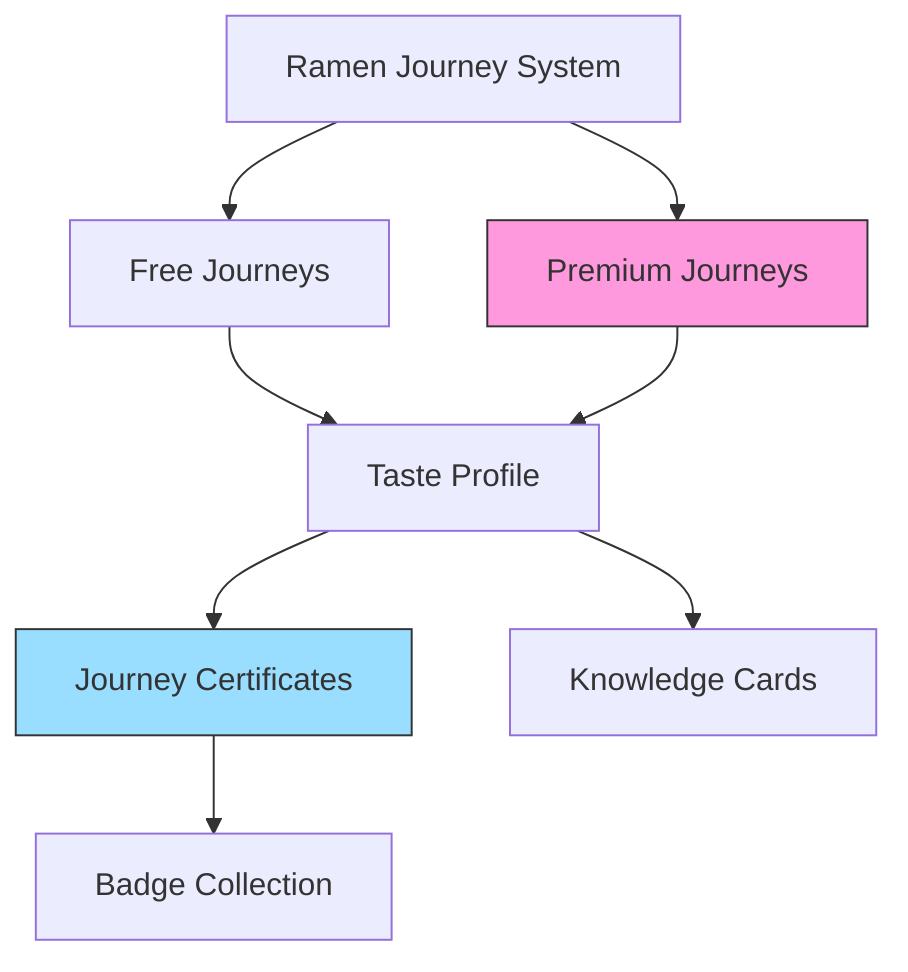

# Ramen Journey Gamification Plan

## Core Concept: Taste Discovery Through Structured Journeys

We'll enhance the existing journey system with gamification elements that encourage completion, create personal investment, and culminate in meaningful certificates. The journeys themselves will be standard, pre-created content, with some being free and others premium (locked).



## Key Framework Components

1. **Standard Journey Structure**
   - Pre-defined journeys created by the content team
   - Clear distinction between free and premium content
   - Consistent format across all journeys

2. **Integrated Taste Profile System**
   - Emerges organically from journey interactions
   - Evolves as users complete more journeys
   - Visualized within completion certificates
   - Provides subtle guidance for future explorations

3. **Completion Certificates**
   - Reward for finishing each journey
   - Showcases key knowledge gained
   - Displays taste preferences discovered
   - Shareable format for social proof

4. **Knowledge Card Collection**
   - Collectible cards discovered throughout journeys
   - Different rarities for added excitement
   - Collection tracking across all journeys

## Implementation Plan

### Phase 1: Journey Framework (2 weeks)

1. **Journey Progress Tracking**
   - Implement robust user progress tracking system
   - Create premium/free journey distinction
   - Add progress visualization on journey pages

2. **Certificate Generation System**
   - Design journey completion certificates
   - Implement generation logic at 100% completion
   - Create basic sharing functionality

3. **Knowledge Card Integration**
   - Leverage existing KnowledgeCardDisplay component
   - Implement card discovery points in journey content
   - Create collection tracking system

### Phase 2: Taste Profile Integration (2 weeks)

1. **Integrated Preference Tracking**
   - Create schema for storing user taste preferences
   - Add natural preference questions within journey content
   - Connect preferences to certificate generation

2. **Enhanced Journey UI**
   - Add premium content indicators with clear unlock paths
   - Create visual distinction between completed and in-progress journeys
   - Implement notification system for new unlocks

3. **Completion Rewards**
   - Design badge system for journey completions
   - Create user achievement showcase
   - Implement certificate gallery

## Technical Implementation

### Database Schema

```sql
-- Premium content access
CREATE TABLE user_subscriptions (
  id SERIAL PRIMARY KEY,
  user_id UUID REFERENCES auth.users(id),
  is_premium BOOLEAN DEFAULT FALSE,
  subscription_tier VARCHAR(50),
  expiration_date TIMESTAMP WITH TIME ZONE,
  created_at TIMESTAMP WITH TIME ZONE DEFAULT CURRENT_TIMESTAMP
);

-- Journey progress
CREATE TABLE user_journey_progress (
  id SERIAL PRIMARY KEY,
  user_id UUID REFERENCES auth.users(id),
  journey_id INTEGER NOT NULL,
  episode_id INTEGER NOT NULL,
  is_completed BOOLEAN DEFAULT FALSE,
  completion_percentage INTEGER DEFAULT 0,
  last_accessed_at TIMESTAMP WITH TIME ZONE DEFAULT CURRENT_TIMESTAMP,
  UNIQUE(user_id, journey_id, episode_id)
);

-- Completion certificates
CREATE TABLE user_journey_certificates (
  id SERIAL PRIMARY KEY,
  user_id UUID REFERENCES auth.users(id),
  journey_id INTEGER NOT NULL,
  completed_at TIMESTAMP WITH TIME ZONE DEFAULT CURRENT_TIMESTAMP,
  certificate_image_url TEXT,
  taste_insights JSONB,
  share_code VARCHAR(50) UNIQUE
);

-- Taste preferences (updated through journey interactions)
CREATE TABLE user_taste_preferences (
  id SERIAL PRIMARY KEY,
  user_id UUID REFERENCES auth.users(id),
  -- Core flavor preferences (1-10 scale)
  richness INTEGER DEFAULT 5,
  saltiness INTEGER DEFAULT 5,
  spiciness INTEGER DEFAULT 5,
  umami INTEGER DEFAULT 5,
  acidity INTEGER DEFAULT 5,
  -- Updated timestamp
  updated_at TIMESTAMP WITH TIME ZONE DEFAULT CURRENT_TIMESTAMP
);

-- Card collection tracking
CREATE TABLE user_knowledge_cards (
  id SERIAL PRIMARY KEY,
  user_id UUID REFERENCES auth.users(id),
  card_id INTEGER NOT NULL,
  collected_at TIMESTAMP WITH TIME ZONE DEFAULT CURRENT_TIMESTAMP,
  UNIQUE(user_id, card_id)
);
```

### Component Enhancements

1. **JourneyProgressTracker**: Enhanced version of current progress indicator
2. **PremiumContentGate**: Improved version of existing premium content lock
3. **JourneyCertificate**: Completion certificate generation and display
4. **TasteInsightsDisplay**: Simple visualization of journey-specific taste insights
5. **KnowledgeCardCollection**: Gallery view of collected cards

## User Experience Flow

1. User browses available journeys (both free and premium)
2. They begin a free journey and progress through episodes
3. Throughout the journey, they:
   - Encounter natural preference questions within content
   - Collect knowledge cards
   - Unlock achievements
4. Upon completion, they receive a certificate showing:
   - Journey completion achievement
   - Taste insights gained from this specific journey
   - Knowledge cards collected
5. The system subtly recommends related journeys based on preferences
6. Premium journeys are clearly marked with unlock requirements

## Integration Points for Taste Profile

The taste profile is not a separate feature but an integrated outcome of the journey experience:

1. **Content Integration**: Preference questions appear naturally within journey content:
   ```
   "You've learned about Tonkotsu broth. On a scale of 1-5, how appealing is this rich, 
   pork-based style to you?"
   ```

2. **Progressive Building**: Each journey contributes new dimensions to the profile:
   - Tonkotsu journey → Reveals pork/richness preferences
   - Shoyu journey → Reveals soy/umami preferences
   - Regional journey → Reveals style preferences

3. **Certificate Visualization**: Each certificate shows journey-specific insights:
   ```
   "Your Tonkotsu Journey revealed: You prefer rich broths (8/10) with medium 
   spice levels (6/10) and enjoy garlic notes."
   ```

4. **Subtle Recommendations**: Based on profile, system highlights compatible journeys:
   ```
   "Based on your preferences, you might enjoy exploring Tori Paitan next."
   ```

## Premium Journey Framework

- Premium journeys follow the same structure as free journeys
- Premium indicators clearly show which content requires subscription
- Teasers of premium content are available to free users
- Premium unlocks provide immediate access to all locked content
- The content for premium journeys will be added manually by the content team

## Certificate Design

Each certificate serves as a tangible reward for journey completion:

```
┌─────────────────────────────────────────────────────┐
│                                                     │
│    🏆 TONKOTSU MASTER JOURNEY CERTIFICATE 🏆       │
│                                                     │
│  Awarded to: [Username]                             │
│  Completed: [Date]                                  │
│                                                     │
│  ✨ TASTE INSIGHTS ✨                               │
│  • Rich broth preference: 8/10                      │
│  • Garlic intensity: 7/10                           │
│  • Noodle thickness: Medium-thick                   │
│                                                     │
│  📚 KNOWLEDGE ACQUIRED 📚                          │
│  • 12 Knowledge Cards Collected                     │
│  • 3 Legendary Cards Discovered                     │
│                                                     │
│  🌟 ACHIEVEMENT UNLOCKED 🌟                        │
│  "Tonkotsu Enthusiast"                              │
│                                                     │
│  [QR Code for Sharing]                              │
│                                                     │
└─────────────────────────────────────────────────────┘
```

## Success Metrics

- **Journey Completion**: 40%+ increase in journey completion rates
- **Premium Conversion**: 10%+ of active users subscribe to premium
- **Certificate Generation**: 80%+ of completed journeys result in certificates
- **Return Rate**: 50%+ increase in return visits within 14 days
- **User Satisfaction**: 4.5+ rating for the journey experience

## Next Steps

1. Enhance the journey progress tracking system
2. Implement certificate generation at journey completion
3. Add knowledge card collection points to journey content
4. Create premium content gates with clear unlock paths
5. Develop preference question integration within journey content
6. Build certificate visualization for taste insights

This framework creates a unified journey experience where taste discovery happens naturally through educational content. The certificates serve as both achievement recognition and personal insight, while knowledge cards add a collectible dimension that encourages completionism.